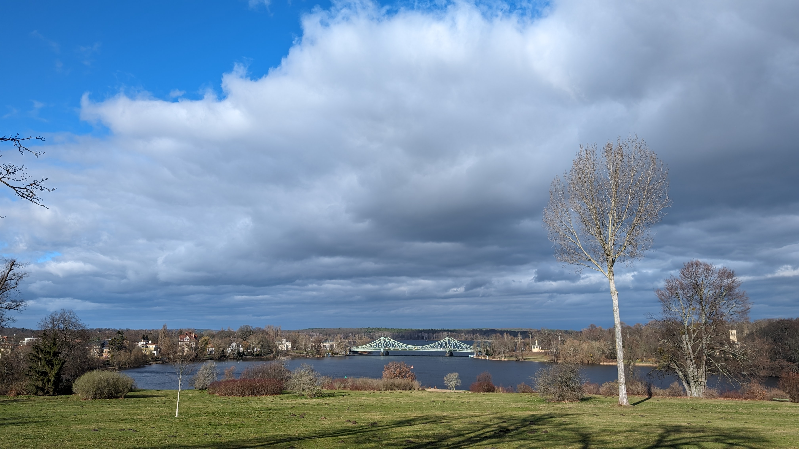

# Development Manager, Software Architect and Open Source Fanboy

I have been leading the development of SaaS applications with Spring Boot backends and Vue.js and Angular frontend for several years. As a development manager and software architect, I take responsibility for all aspects of the design, development process and operation of the application. I always have an open ear for my colleagues, recognize and resolve conflicts and support everyone individually in their further development. People are more complicated than computers.

I have never lost the fun and passion for writing source code. Before my time as an architect and development manager, I worked for many years as a developer on various projects.

I work as a software architect at [\]init\[ AG](https://www.init.de/en). Before that, I developed a cloud-based practice management system for psychotherapists together with my team at [Epikur GmbH](https://www.epikur.de/). And for over 10 years, I was head of development for the [open source project verinice](https://github.com/SerNet/verinice) at [SerNet GmbH](https://www.sernet.de/en/). Verinice is a platform for managing information security and data protection. 

I have been an open source software enthusiast since I started using computers in the 90s. Since then, I have been using free software with open source code professionally as a software developer and development manager, but also privately whenever possible.
